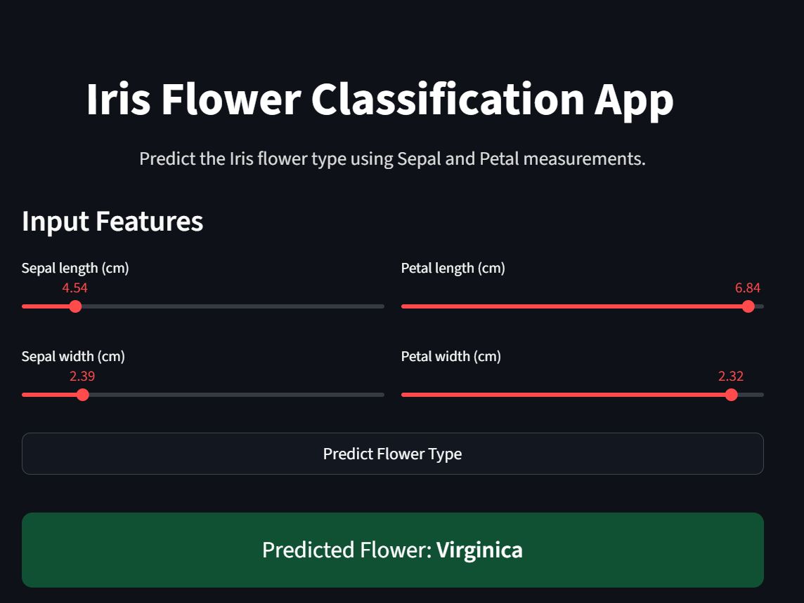
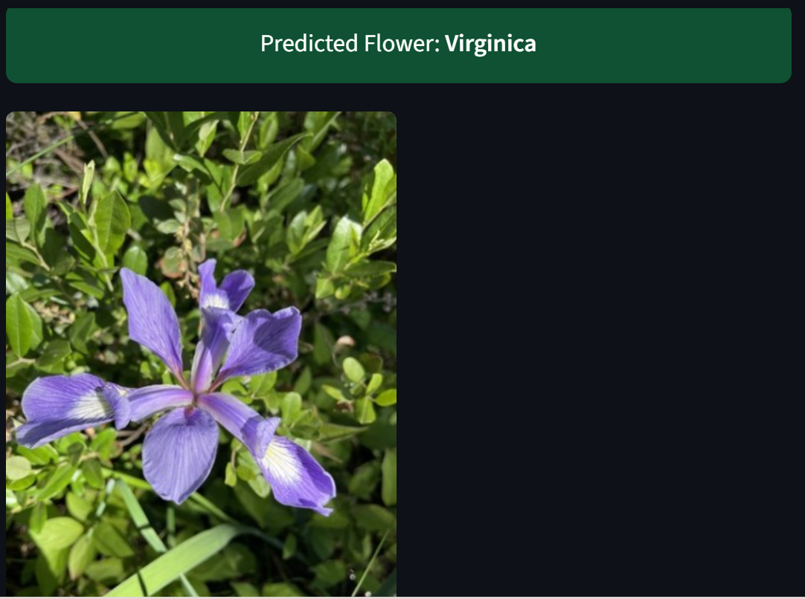
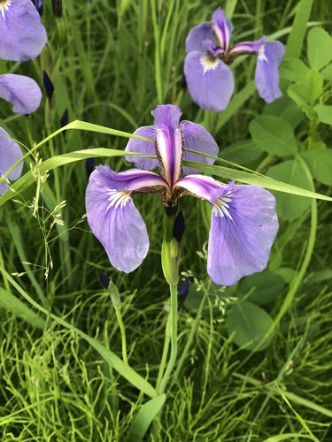
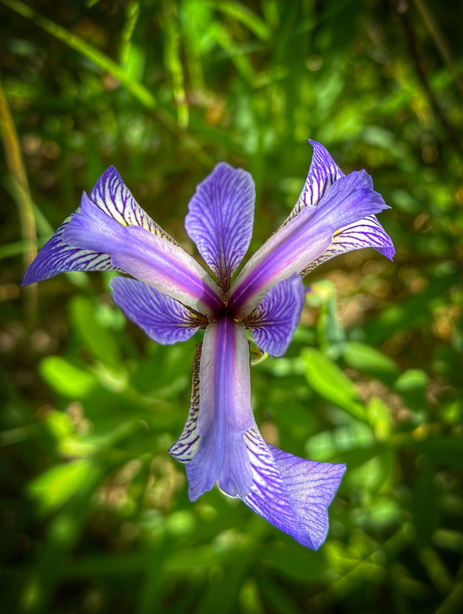
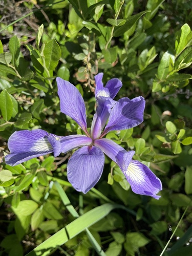

# 🌸 Iris Flower Classification – End-to-End Machine Learning Project  
### Built by **Prasanna Kumar**

[](https://www.credly.com/badges/960adb8c-c3ed-4214-8ab4-9528c93bef21/public_url)


---

## 📌 Project Overview

This project demonstrates a complete **Machine Learning Engineering workflow** — from data exploration to a fully interactive **Streamlit Web Application**.

The goal is to classify Iris flowers into:

- **Setosa**
- **Versicolor**
- **Virginica**

using four numeric measurements:

- Sepal Length  
- Sepal Width  
- Petal Length  
- Petal Width  

This project includes:

- ✔ Exploratory Data Analysis (EDA)  
- ✔ Logistic Regression Model  
- ✔ Model Evaluation  
- ✔ Model Saving (`iris_model.pkl`)  
- ✔ Streamlit App Deployment  
- ✔ Real-time prediction with flower images  
- ✔ Modern UI  

---

## 📁 Project Structure

```
project/
│
├── images/
│     ├── iris.png
│     ├── iris_classification.jpg
│     ├── iris_predict.jpg
│     ├── iris_setosa.jpg
│     ├── iris_versicolor.jpg
│     └── iris_virginica.jpg
│
├── iris_model.pkl
├── streamlit_app.py
└── multi_class_Logist.ipynb
```

---

## 🧠 Problem Statement

Predict the Iris flower species using four numeric inputs.

| Species | Label |
|--------|--------|
| Setosa | 0 |
| Versicolor | 1 |
| Virginica | 2 |

This is a **multiclass classification task**.

---

## 📊 Dataset Overview

- Samples: **150**
- Features: **4**
- Classes: **3**
- Source: `sklearn.datasets.load_iris()`

### Iris Diagram  
(stored in `images/iris.png`)

---

## 📈 Exploratory Data Analysis (EDA)

The notebook includes:

- Scatter plots  
- Pair plots  
- Feature relationships  
- Class distributions  
- Correlation maps  

---

## 🤖 Model Details

The model used is:

### **Logistic Regression (Multinomial Softmax)**

```python
from sklearn.linear_model import LogisticRegression

model = LogisticRegression(max_iter=300)
model.fit(X_train, y_train)
```

---

## 💾 Saving the Model

```python
import joblib
joblib.dump(model, "iris_model.pkl")
```

---

## 🧪 Model Evaluation

Includes:

- Accuracy  
- Classification Report  
- Confusion Matrix (heatmap)  

All results are available inside the Jupyter Notebook.

---

## 🌐 Streamlit Application

The web application includes:

- Slider-based input  
- Predict button  
- Clean modern UI  
- Probability bar chart  
- High-quality flower images  

Run the app using:

```bash
streamlit run streamlit_app.py
```

---

## 🎨 Streamlit UI Preview

### **Main Interface**


### **Final Prediction Output**


### **Reference Flower Images**


<p align="center">
  
  
  
</p>

---

## ▶️ Installation & Setup

### **1. Create Virtual Environment**
```bash
python -m venv .venv
```

### **2. Activate**
Windows:
```bash
.venv\Scriptsctivate
```

Mac/Linux:
```bash
source .venv/bin/activate
```

### **3. Install Dependencies**
```bash
pip install -r requirements.txt
```

If you don’t have `requirements.txt` yet:

```
streamlit
scikit-learn
numpy
pandas
joblib
matplotlib
seaborn
```

---

## 🎉 Conclusion

This project demonstrates:

- ✔ Full ML workflow  
- ✔ End-to-end deployment  
- ✔ Clean UI  
- ✔ Model + App integration  
- ✔ Professional documentation  

Perfect for:

- ML Portfolio  
- GitHub  
- Interview showcase  

---

## 👤 Author

**Prasanna Vaddemanu**  
Machine Learning Engineer & Data Scientist  
  
